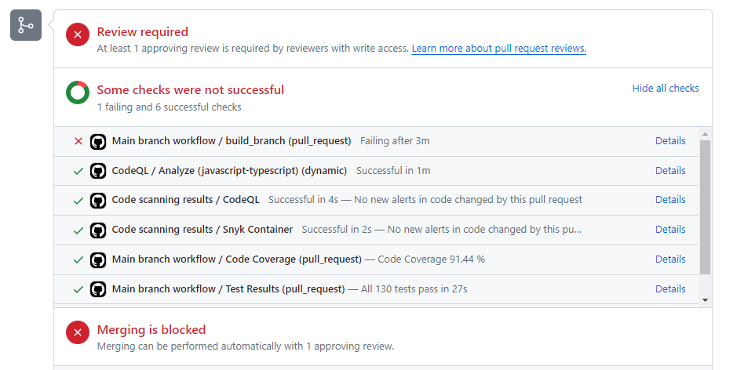
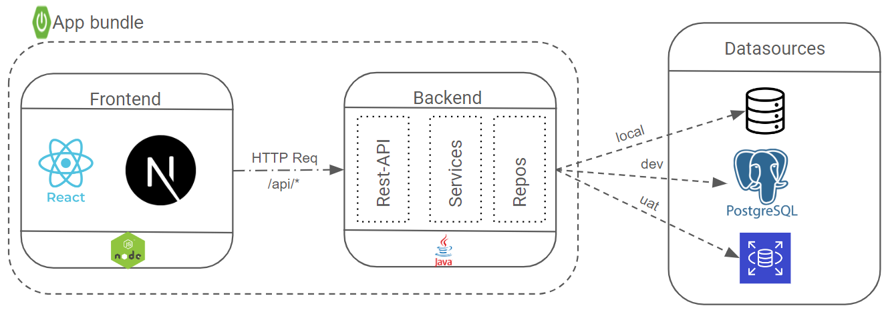

# Digiboard: demo fullstack app (Java + React) with Github Actions CI/CD pipeline

1. [Introduction](#Introduction)
2. [Quick start](#quick-start)
3. [Github Actions CI/CD pipeline](#github-actions-ci-cd-pipeline)
   - [Branching strategies & Worflow](#branching-strategies--worflow)
     1. [feature branch](#features-branches)
     2. [main branch](#main-branch)
   - [Infrastructure](#infrastructure)
4. [App structure](#App-structure)
   - [Frontend](#Frontend)
   - [Backend](#Backend)
   - [Datasources](#datasources)
   - [Dockerizing the app](#dockerizing-the-app)
   - [Tests](#tests)

## Introduction

This demo project features a fullstack app, built as an single artifact and ready to be deployed in different contexts(local, docker environment as well as local/aws Kubernetes clusters).Though the app is runnable and deployable, some of its feature are still to be completed.

## Quick start

In order to run the project locally, kindly follow these steps:

1. checkout the project from the repo

   ```
    git clone https://github.com/arthur-abanda-ndjock/arthur-digiboard.git
   ```

2. move inside the root folder, build using maven and run it as a spring boot app

   ```
    mvn clean package
    java -jar .\arthur-digiboard-backend\target\arthur-digiboard.jar --spring.profiles.active=local
   ```

   then in the browser call the url: `http://localhost:8080/`

3. (Optional) additionally, if you have a docker environment you can build an image inside the root folder and run it as container.

   ```
    docker build -t <<YOUR_DOCKER_REPO>>/digiboard:1.5 .
    docker push <<YOUR_DOCKER_REPO>>/digiboard:1.5
    docker run -p 8080:8080 <<YOUR_DOCKER_REPO>>/digiboard:1.5
   ```

[Back to top](#digiboard-demo-fullstack-app-java--react-with-github-actions-cicd-pipeline)

## Github Actions CI CD pipeline


### Branching strategies & Worflow:

For such a small project has 2 branch types: the feature & main branches:

#### 'Features' branches:

The features branches have the code of all the new features being developed and they can receive code directly from a dev (git push). Their [pipeline workflow](.github/workflows/feature-branch.yaml) include the following steps:

1. Compile & the app with the 'default' profile as well as run as the revelant tests
2. Generate & publish test coverage to GitHub Actions
3. Do the same with linting results.
4. Build a docker image using the generate app jar file
5. Scan the image in search for security vulnerabilities & publish scan report to GitHub Actions

#### 'Main' branch:

The main branch cannot have code pushed into, rather have code merged into from other branches. For the merge PR to be allowed, some branch protection checks must passed. If is not the case, the merging will be blocked:



This contributes keeping the main branch as clean ans safe as possible.

Once the PR is merged, the main branch's [workflow](.github/workflows/main-branch.yaml) start with a similar pattern as the feature branch's (other than building the app using the "dev" profile) and adds following steps:

6. push the docker image to aws ECR
7. connect to the present aws EKS cluster
8. Fetch the image from aws ECR and deploy it to EKS cluster

[Back to top](#digiboard-demo-fullstack-app-java--react-with-github-actions-cicd-pipeline)

### Infrastructure

The target infrastructure for the app is AWS. All the necessary elements (VPC, subnets, EKS-cluster, ECR and RDS, etc...) are provisioned in [this](https://github.com/arthur-abanda-ndjock/arthur-digiboard-terraform) separate terraform project.

## App structure



The app is built as single deployable artifact bundling both front- and back-ends.

### Frontend:

Frontend is built using React and NextJs and communicate to the backend REST API.

### Backend:

Backend is build with Spring boot and the typical RestController-Service-Repo structure.

### Datasources:

there is various datasources depending on the environments the app is running to:

- In-memory database (for _local_ environment)
- Local postgresql k8s cluster database (for _dev_ environment)
- AWS RDS database (for _uat_ environment in the cloud)

Details are found in [this](arthur-digiboard-backend/src/main/resources) folder, inside the `application-*.yaml` file

### Dockerizing the app

In order to make sure that the right docker image deployable to the right infra, the final DockerFile is generated during the build from a [DockerFile template](arthur-digiboard-backend/Dockerfile.template). Subsequently a deployable docker image can be generated for the local environment, another one for a dev environment,
another one for a uat environment, etc.

The generated DockerFile is written to make the docker container as light and as secure as possible:

- using a safe minimum sized base image (regularly scanned by Snyk)
- using a dumb initializer
- creating & granting least priviledge to specific os user (instead of user the default root), to run the process
- specify the environment/profile the process should run in/with.

### Tests:

The backend code is covered in about 90% by tests. Those included are:

- Unit tests (for Controllers, services and repositories)
- some integration tests with the default spring boot
- some docker-supported integration tests

[Back to top](#digiboard-demo-fullstack-app-java--react-with-github-actions-cicd-pipeline)
